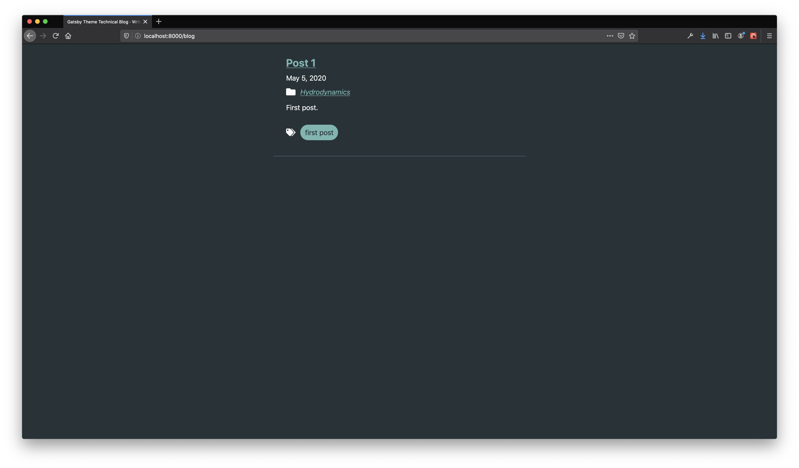

# Gatsby Theme Tech(nical) Blog

<p align="center">
  
</p>

[](https://www.npmjs.com/package/@lbsonley/gatsby-theme-technical-blog) [](https://www.npmjs.com/package/@lbsonley/gatsby-theme-technical-blog) [](license)

A feature-rich, customizable Gatsby Blog Theme for technical bloggers. Useful for developers, scientists, teachers and anyone who wants to publish technical documents. 

**Features**

  - Categorization and Tagging
  - SEO Meta Data
  - Write posts in MDX
  - Configurable theming (`theme-ui`)
  - Code blocks (`prismjs`)
  - KaTeX Math (`katex`)
  - Image optimization (`sharp`)
  - Gif support

## Quick Start

Install the theme on an existing project.

```sh
yarn add @lbsonley/gatbsy-theme-technical-blog
# or
npm i @lbsonley/gatsby-theme-technical-blog
```

Add it to your sites `gatsby-config.js`

```js
module.exports = {
  plugins: [
    "gatsby-theme-tech-blog"
  ]
};
```

Now start up gatsby with `gatsby develop` and you are ready to start writing your blog.

## Configuration

There are several options for configuring `gatsby-theme-technical-blog`, when you include it as a plugin in `gatsby-config.js`.

| Property | Type | Default | Description |
| --- | --- | --- | --- |
| postsPath | string | "posts" | The directory, from the root of your project, where theme looks for `*.mdx` files. |
| basePath | string | "/blog" | The path at which pages will be created. |
| categories | boolean | true | Whether or not to create an index page for categories |
| tags | boolean | true | Whether or not to create an index page for tags |
| categorySeoTitle | string | "Posts categorized:" | Used in SEO title on PostsByCategory page. Dynamically combined with selected category to produce a title "Post categorized: {category}". |
| tagSeoTitle | string | "Posts tagged:" | Used in SEO title on PostsbyTag page. Dynamically combined with selected category to produce a title "Post tagged: {tag}". |

```js
module.exports = {
  plugins: [
    {
      resolve: "gatsby-theme-technical-blog",
      options: {
        contentPath: "docs", // look for mdx files in docs directory
        basePath: "/docs", // publish pages at /docs/{page}
        categories: true,
        categorySeoTitle: "Docs categorized:",
        tags: true,
        tagSeoTitle: "Docs tagged:"
      }
    }
  ]
};
```

## Categorization and Tagging

The theme supports two ways to organize content; categories and tags. Categories should be used to group content by it's function (i.e. tutorials, gists, and opinions) and tags should be used to describe the topic (i.e. react, redux, and graphql).

Both categorization and tagging are enable by default. If you don't need both, you can turn off one or the other in the theme config (see above).

## Frontmatter

The theme builds and sorts pages based on metadata included in `mdx` files via frontmatter. All of the frontmatter fields are required unless otherwise disabled in the configuration object. If a frontmatter field is not present Gatsby will throw errors when building. Make sure to include a complete frontmatter object at the beginning of each `mdx` file.

| Key | Example Value | Description |
| --- | --- | --- |
| title | Rad Technical Stuff | The title for the content |
| date | 2020-05-13 | The date of publication |
| category | tutorials | Categorical grouping of content. Can be disabled |
| tags | [ "react", "redux" ] | Tagged grouped of content. Can be disabled |
| published | true | Whether or not to publish the content |

```js
---
  title: Rad technical stuff
  date: 2020-05-13
  category: tutorials
  tags: [ "react", "redux" ]
  published: true
---
```

## Adding a Layout

To allow for easy customization and integration into existing gatsby sites, the theme does not include a layout. The best way to add a layout is to use `wrapPageElement` from the [Gatbsy Browser API](https://www.gatsbyjs.org/docs/browser-apis/#wrapPageElement). To do this, first install `theme-ui` if you havent' already. This way, we can use the `sx` property to access theme variables when styling our layout component. If you are not familiar with `theme-ui` you can read about [the sx prop here](https://theme-ui.com/sx-prop).

```sh
yarn add theme-ui
```

With `theme-ui` installed, create a layout component in your sites `src/components` directory that looks something like this. 

```jsx
/** @jsx jsx */
import {
  jsx,
  Flex,
  Container,
  Styled,
  Link as ThemeLink,
} from "theme-ui";
import { Link } from "gatsby";

const Layout = ({ children }) => {
  return (
    <Flex sx={{ flexDirection: "column", minHeight: "minHeight" }}>
      <Flex
        as="header"
        sx={{
          flex: "0 1 15%",
          justifyContent: "space-between",
          padding: 6,
          marginBottom: 7,
          color: "light",
          bg: "primary",
          boxShadow: "medium",
        }}
      >
        <Styled.h1 sx={{ fontSize: 3, m: 0 }}>
          <ThemeLink
            as={Link}
            to="/"
            sx={{
              color: "light",
              textDecoration: "none"
            }}
          >
            DigiGarden
          </ThemeLink>
        </Styled.h1>
      </Flex>
      <main sx={{ flex: "1 0 70%" }}>
        <Container>{children}</Container>
      </main>
      <Flex
        as="footer"
        sx={{
          flex: "0 1 15%",
          padding: 6,
          marginTop: 7,
          alignItems: "center",
        }}
      >
        <Styled.p sx={{ m: 0 }}>Site Footer</Styled.p>
      </footer>
    </Flex>
  );
};

export default Layout;
```

Now that we have a layout component, we can create a file `gatsby-browser.js` at the root of our project and tell Gatsby to wrap all of our pages in this layout.

```js
const React = require("react");
const Layout = require("./src/components/layout").default;

exports.wrapPageElement = ({ element }) => {
  return (
    <Layout>
      {element}
    </Layout>
  )
}
```

## Customizing `theme-ui`

 The default `theme-ui` configuration for `gatsby-theme-technical-blog` is described in [theme.js](src/theme.js). This can be overridden using [component shadowing](https://www.gatsbyjs.org/docs/themes/shadowing/). Create a file at `src/gatsby-plugin-theme-ui/index.js`, import the default theme and expand/override the defaults.

```js
import { theme as baseTheme } from "@lbsonley/gatsby-theme-technical-blog/src/theme";

export const theme = {
  ...baseTheme,
  colors: {
    ...baseTheme.colors,
    // color overrides
  },
  // other theme-ui settings
}
```

## Using the Color Mode Toggle Component

The `theme-ui` config in `gatsby-theme-technical-blog` supports Light and Dark Mode out of the box. Including a button to toggle the color mode is as easy as importing the component and using it somewhere. For example, you could add it inside the header of your `layout` component. It can be imported like:

```js
import ColorModeToggle from "@lbsonley/gatsby-theme-technical-blog/src/components/color-mode-toggle";
```

## Using KaTeX Math Blocks

`gatsby-theme-technical-blog` automatically recognizes KaTeX blocks in your `.mdx` documents. Just add some KaTeX markup like:

```md 

Math Inline
$\frac{1}{m} \sum_{i=1}^m \big[ (h_\theta(x^{(i)}) - y^{(i)}) ^2 \big]$

Math Block

$$
\frac{1}{m} \sum_{i=1}^m \big[ (h_\theta(x^{(i)}) - y^{(i)}) ^2 \big]
$$
```

## Using Code Blocks

`gatsby-theme-technical-blog` automatically recognizes code blocks in your `.mdx` documents. This is accomplished via the [MDX Provider](https://mdxjs.com/advanced/components#mdxprovider) component from `mdx-js`, [Syntax Highlighting](https://mdxjs.com/guides/syntax-highlighting) and [wrapRootElement](https://www.gatsbyjs.org/docs/browser-apis/#wrapRootElement). Just add a regular markdown code block and let Gatsby handle the magic.

If you want to customize your code block component (i.e. change the color theme), you will need to install `prism-react-renderer`.

```sh
yarn add prism-react-renderer
```

Then you can shadow the [code block component from `gatsby-theme-technical-blog`](src/components/code-block) by creating a file at `src/@lbsonley/gatsby-theme-technical-blog/code-block.js` with the following content. Just exchange the theme import below with the [theme](https://github.com/FormidableLabs/prism-react-renderer/tree/master/src/themes) of your choice.

```jsx
/** @jsx jsx */
import { jsx } from "theme-ui";
import Highlight, { defaultProps } from "prism-react-renderer";
import themeLight from "prism-react-renderer/themes/oceanicNext";

const CodeBlock = ({ children, className }) => {
  const language = className ? className.replace(/language-/, "") : "";
  return (
    <Highlight
      {...defaultProps}
      code={children}
      language={language}
      theme={themeLight}
    >
      {({ className, style, tokens, getLineProps, getTokenProps }) => (
        <pre className={className} style={style} sx={{ p: 5 }}>
          {tokens.map((line, i) => (
            <div {...getLineProps({ line, key: i })}>
              {line.map((token, key) => (
                <span {...getTokenProps({ token, key })} />
              ))}
            </div>
          ))}
        </pre>
      )}
    </Highlight>
  );
};

export default CodeBlock;
```

## Additional Resources

The theme is built on the [shoulders of giants](https://en.wikipedia.org/wiki/Standing_on_the_shoulders_of_giants). An effort has been made above to document the minimum information needed to get up and running quickly with `gatsby-theme-technical-blog`. Should you need more in depth documentation for one of the technologies used to build this theme, check out the links below.

- [Gatsby](https://www.gatsbyjs.org/docs/)
- [MDX](https://mdxjs.com/)
- [Theme UI](https://theme-ui.com/getting-started)
- [Prism React Renderer](https://github.com/FormidableLabs/prism-react-renderer)
- [Katex](https://katex.org/docs/api.html)
